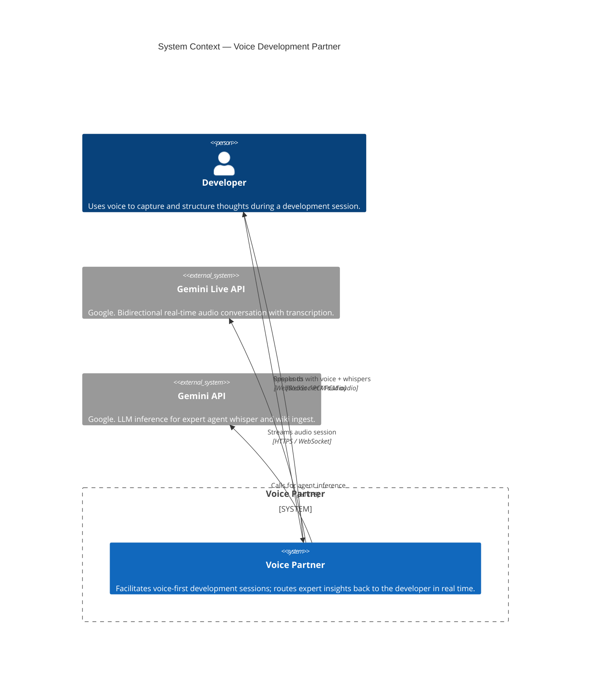
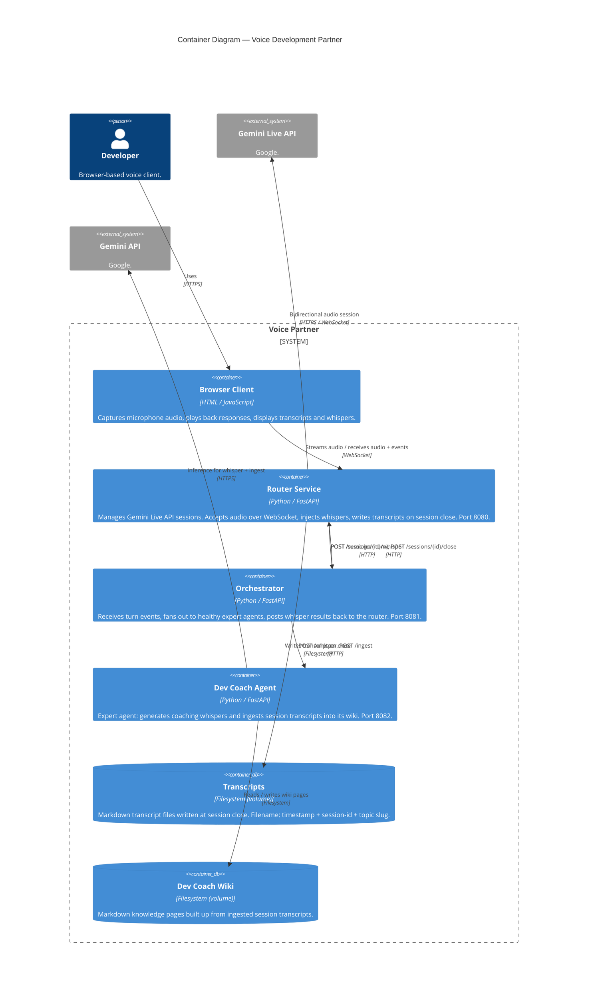
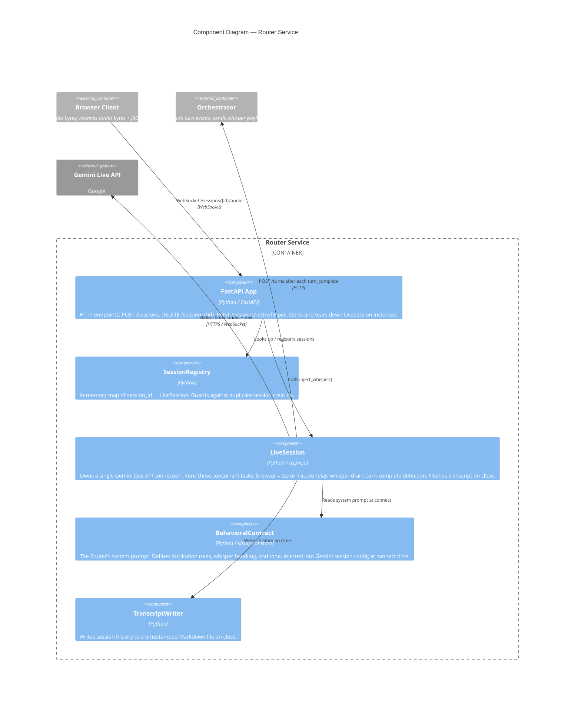
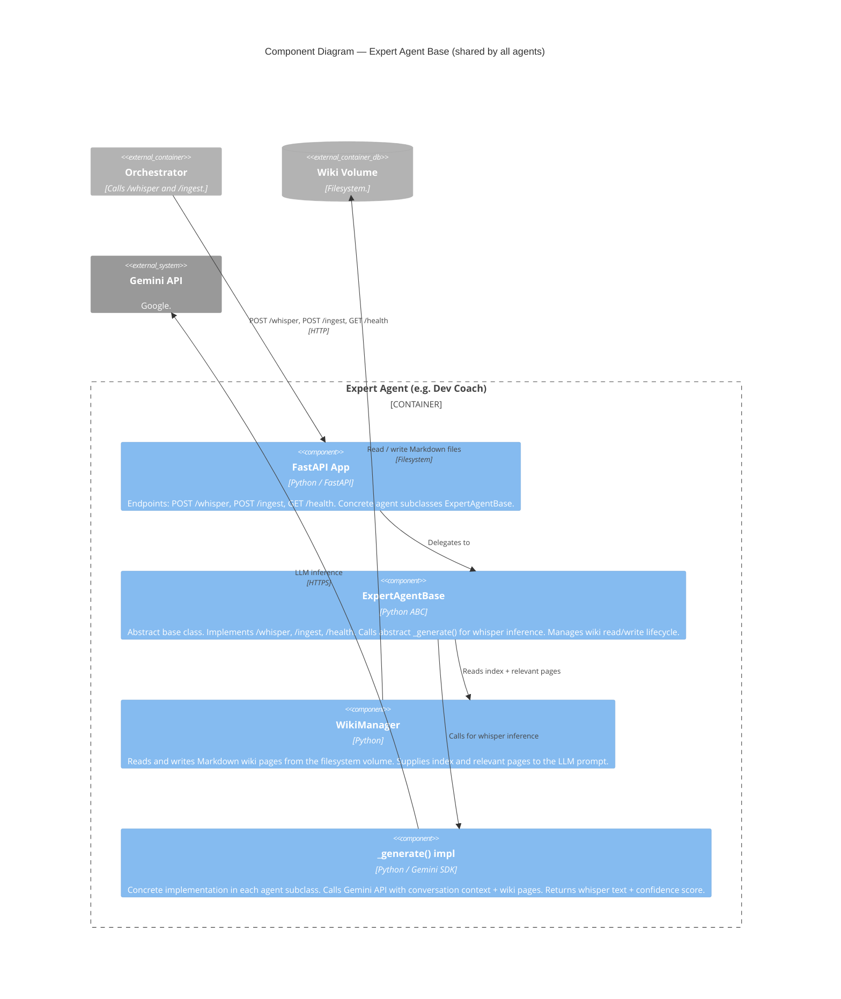

# C4 Architecture Diagrams

Diagrams follow the [C4 model](https://c4model.com). Update these whenever a new service, container, or major component is added or removed. See backlog item E6-F for the maintenance workflow.

---

## Level 1 — System Context

Who uses the system and what external systems does it depend on.

---

## Level 2 — Containers

The deployable units inside the system.

---

## Level 3 — Router Service Components

Internal structure of the most complex container.

---

## Level 3 — Expert Agent Base Components

Internal structure shared by all expert agents (via `ExpertAgentBase`).

---

*Last updated: 2026-04-29. Generated manually from codebase inspection — no tooling required.*
