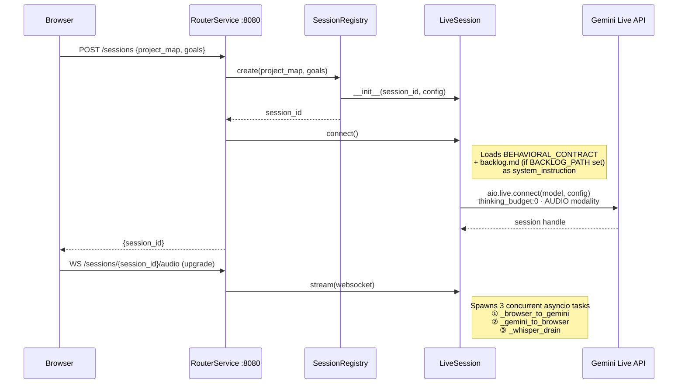
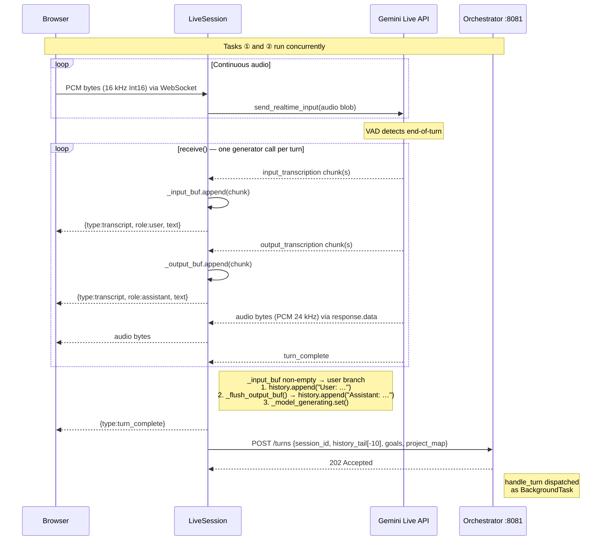
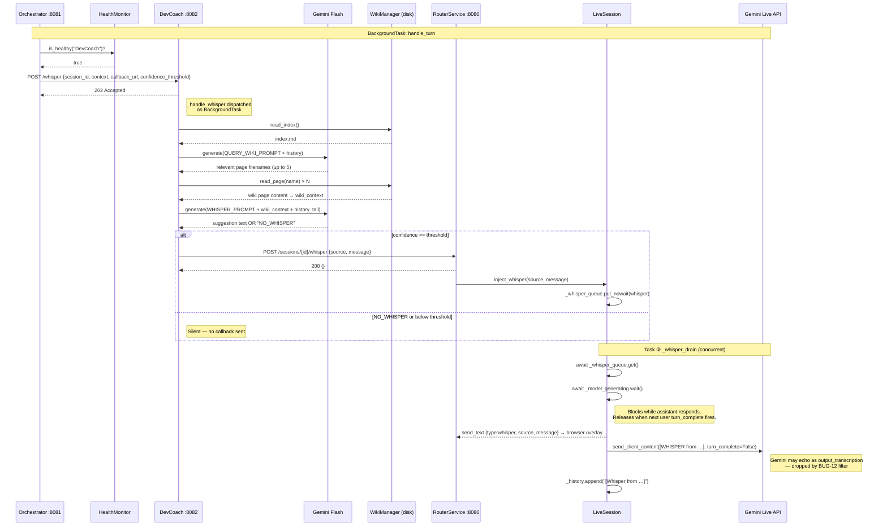
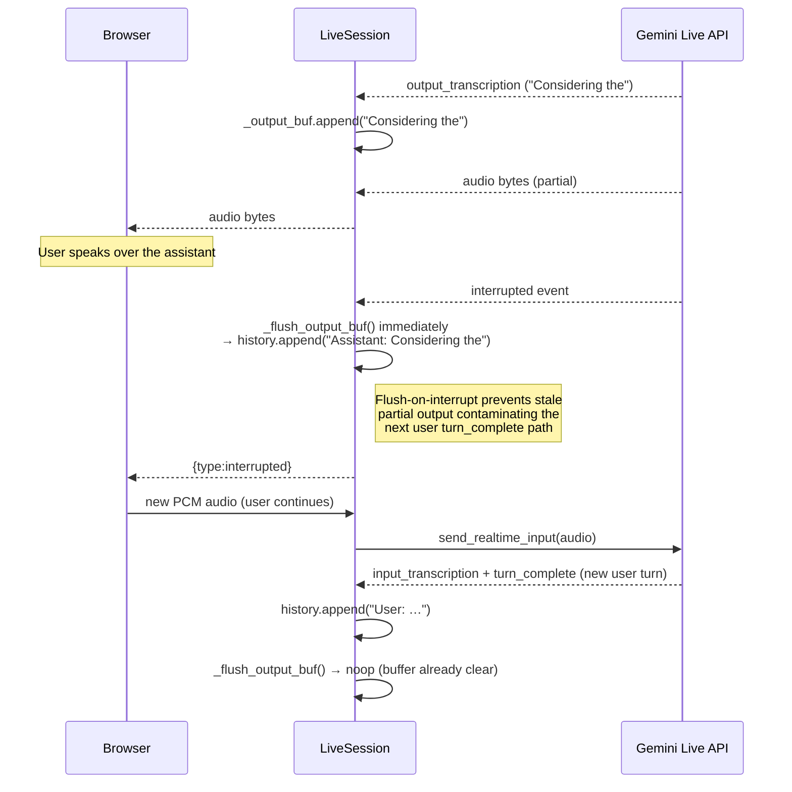
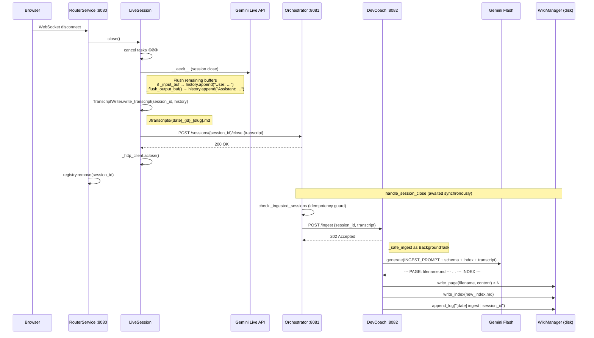
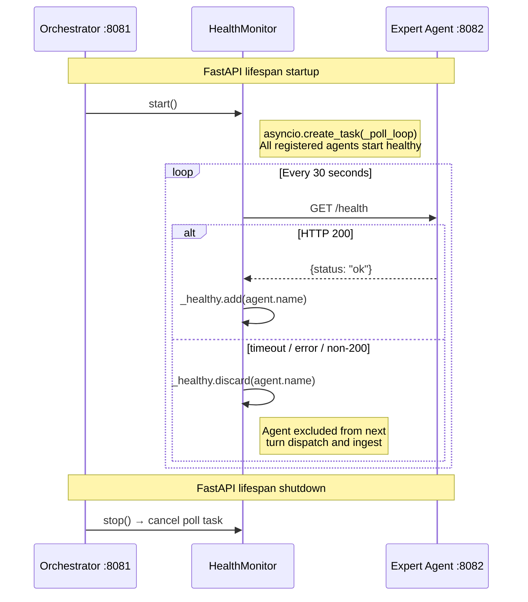

# System Interaction Flows

Sequence diagrams for all major interaction paths in the voice-first development partner. Services:

| Service | Role | Port |
|---|---|---|
| Browser | Web client — microphone in, audio + transcript out | — |
| RouterService | FastAPI + WebSocket, owns Gemini Live session | 8080 |
| LiveSession | Manages 3 concurrent async tasks per session | (in-process) |
| Gemini Live API | Real-time bidirectional audio + transcription | external |
| Orchestrator | Turn handler, agent registry, health monitor | 8081 |
| DevCoach | First expert agent (Gemini 2.0 Flash) | 8082 |
| WikiManager | Per-agent persistent knowledge store | (disk) |

---

## 1 — Session Startup

Browser creates a session, the router opens a Gemini Live API connection with the behavioral contract loaded as system instruction, then upgrades to a WebSocket and spawns three concurrent tasks.

---

## 2 — Per-Turn Flow

Each time the user speaks, audio is streamed to Gemini, transcribed in both directions, committed to `_history` in the correct order, and then the turn event is dispatched to the orchestrator for expert agent processing.

---

## 3 — Whisper Pipeline

After each turn, the orchestrator fans out to all healthy agents. Each agent queries its wiki for relevant context, calls Gemini Flash to generate a suggestion, and POSTs the result back as a whisper callback. The `_whisper_drain` task injects it into the live Gemini session as silent context.

---

## 4 — Interrupted Turn

When the user speaks over the assistant mid-response, Gemini emits an `interrupted` event. Partial output is flushed to history immediately, preventing stale content from contaminating the next user turn.

---

## 5 — Session Teardown and Wiki Ingest

When the browser disconnects, the session closes the Gemini connection, writes the transcript to disk, and notifies the orchestrator synchronously. The orchestrator fans out `/ingest` to all healthy agents, which run knowledge extraction as background tasks.

---

## 6 — Health Monitor Background Loop

The orchestrator starts a background polling loop on startup. Only agents that respond with HTTP 200 to `/health` within 5 seconds are eligible to receive turn events and ingest calls.

---

## Concurrency Model

The three tasks spawned by `LiveSession.stream()` share mutable state without locks. This is safe because asyncio uses cooperative scheduling — only one coroutine runs at a time, and no task yields between a read and its dependent write on `_history`, `_input_buf`, or `_output_buf`.

| Task | Owns | Reads |
|---|---|---|
| `_browser_to_gemini` | — | browser WebSocket |
| `_gemini_to_browser` | `_input_buf`, `_output_buf`, `_history`, `_model_generating` | Gemini event stream |
| `_whisper_drain` | `_whisper_queue` appends to `_history` | `_model_generating` |
